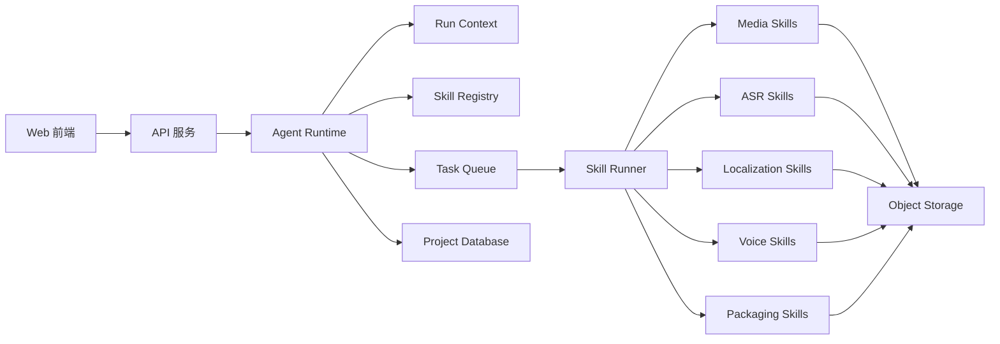

# Agent + Skill + Web 前端编排设计

## 1. 定位

本项目建议采用 Web 前端 + Agent Runtime + Skill 的组合方式实现。

核心思想：

- Web 前端是内部运营的操作台。
- Agent Runtime 是任务编排层，负责把一个视频本地化任务拆成多个可追踪步骤。
- Skill 是可复用能力单元，每个 Skill 只完成一类清晰任务。
- Worker 是 Skill 的执行环境，可本地执行，也可调用外部模型 API。

MVP 中的 Agent 不应被设计成完全自主决策系统。它更像一个可观察、可重试、可暂停的流程编排器。

## 2. 总体关系



## 3. Agent 分工

### 3.1 Supervisor Agent

职责：

- 根据用户配置创建执行计划。
- 调用合适的 Skill。
- 维护 run_context。
- 处理失败重试。
- 在人工校对点暂停。
- 汇总质量提示。

不能做：

- 不直接修改已锁定句段。
- 不绕过人工校对自动发布最终结果。
- 不直接持有模型 API key。

### 3.2 Media Agent

职责：

- 调用视频探测、音频提取、声源分离 Skill。
- 产出 source_audio、source_vocal、background_audio。
- 标记声源分离质量。

### 3.3 Transcript Agent

职责：

- 调用 ASR Skill。
- 调用分句和时间轴规整 Skill。
- 生成统一 Segment。
- 可选调用说话人识别 Skill。

### 3.4 Localization Agent

职责：

- 调用 DeepSeek 或其他 LLM 翻译 Skill。
- 应用短剧本地化 prompt。
- 应用术语表、角色设定、目标地区风格。
- 标记过长、疑似直译、缺失翻译等质量问题。

### 3.5 Voice Agent

职责：

- 为 speaker_id 选择目标语言 voice_id。
- 调用 TTS Skill。
- 检查 TTS 时长偏差。
- 支持单句或单语言重跑。

### 3.6 Packaging Agent

职责：

- 调用字幕生成 Skill。
- 调用音频拼接、对齐、混音 Skill。
- 生成网页播放器 manifest。
- 生成下载包。

## 4. Skill 目录

| Skill | 输入 | 输出 | 说明 |
| --- | --- | --- | --- |
| media.probe | source_video | media metadata | 解析视频时长、编码、音轨。 |
| media.extract_audio | source_video | source_audio | 提取原始音频。 |
| audio.separate_sources | source_audio | source_vocal, background_audio | 分离人声和背景音。 |
| asr.transcribe | source_vocal | raw transcript | ASR 识别。 |
| asr.diarize | source_vocal | speaker timeline | 可选说话人识别。 |
| transcript.normalize_segments | raw transcript | segments | 分句、合并短句、统一时间轴。 |
| localization.translate | segments, style config | translations | 短剧本地化翻译。 |
| subtitle.generate | segments, translations | srt, vtt | 生成外挂字幕。 |
| voice.synthesize | translations, voice config | tts segment audio | 生成分段 TTS。 |
| audio.stitch_vocals | tts segment audio, segments | target_vocal | 按时间轴拼接目标人声。 |
| audio.mix | target_vocal, background_audio | target_mix_audio | 混合目标人声和背景音。 |
| package.manifest | assets | manifest.json | 生成网页预览资源描述。 |
| package.zip | assets | package_zip | 生成下载包。 |
| quality.check | segments, translations, assets | quality flags | 汇总质量提示。 |

## 5. 编排模板

### 5.1 字幕初稿模板

适用：只想快速看翻译效果。

流程：

```text
media.probe
media.extract_audio
audio.separate_sources
asr.transcribe
transcript.normalize_segments
localization.translate
subtitle.generate
pause_for_proofreading
```

### 5.2 完整外切模板

适用：生成多语种字幕和多语种混合音轨。

流程：

```text
media.probe
media.extract_audio
audio.separate_sources
asr.transcribe
asr.diarize
transcript.normalize_segments
localization.translate
pause_for_proofreading
subtitle.generate
voice.synthesize
audio.stitch_vocals
audio.mix
package.manifest
package.zip
```

### 5.3 局部重跑模板

适用：运营修改某几句译文后，只重跑局部配音和混音。

流程：

```text
voice.synthesize selected_segments
audio.stitch_vocals target_language
audio.mix target_language
package.manifest
```

## 6. Run Context

Agent Runtime 在每次执行中维护 run_context，用来传递项目、语言、版本、产物和人工编辑状态。

最小字段：

```json
{
  "run_id": "run_123",
  "project_id": "proj_123",
  "version_id": "ver_001",
  "template": "full_dubbing",
  "source_language": "auto",
  "target_languages": ["en-US", "es-ES"],
  "current_step": "localization.translate",
  "assets": {},
  "segments_version": "segver_001",
  "translation_versions": {
    "en-US": "trver_en_001"
  },
  "human_checkpoints": [
    "proofreading"
  ]
}
```

规则：

- Skill 只能读写自己声明的输入输出。
- Agent 每调用一次 Skill 都必须生成 skill_run 记录。
- 人工编辑后，相关下游产物必须标记为 stale。
- 任何 Skill 失败都不得删除上游产物。

## 7. Skill Contract

每个 Skill 都应实现同一种最小调用契约。

Input:

```json
{
  "skill_name": "localization.translate",
  "skill_version": "1.0.0",
  "project_id": "proj_123",
  "run_id": "run_123",
  "input": {},
  "config": {},
  "idempotency_key": "run_123:localization.translate:en-US:v1"
}
```

Output:

```json
{
  "status": "succeeded",
  "outputs": {},
  "assets": [],
  "quality_flags": [],
  "usage": {
    "provider": "deepseek",
    "model": "deepseek-default",
    "tokens": 1200,
    "cost": null
  },
  "error": null
}
```

失败输出：

```json
{
  "status": "failed",
  "outputs": {},
  "assets": [],
  "quality_flags": [],
  "usage": {},
  "error": {
    "code": "TRANSLATION_FAILED",
    "message": "Provider request failed"
  }
}
```

## 8. 人工协同边界

必须暂停等待人工确认的节点：

- ASR 和翻译初稿完成后。
- 首次完整 TTS 生成前。
- 生成最终下载包前可配置是否暂停。

Agent 可以自动继续的节点：

- 视频探测。
- 音频提取。
- 声源分离。
- ASR。
- 初稿翻译。
- 字幕生成。
- 用户确认后的 TTS、混音和打包。

Agent 不能自动做的事：

- 覆盖 locked segment。
- 删除原始视频。
- 使用未授权声音克隆。
- 把产物发布到外部渠道。
- 修改模型 API key。

## 9. Web 前端如何使用 Agent Runtime

Web 侧只需要关心四件事：

- 创建项目。
- 启动 Agent Run。
- 查询 Run 和 Skill Run 状态。
- 在校对点提交人工修改并继续执行。

推荐页面映射：

| 页面 | Runtime 能力 |
| --- | --- |
| 上传配置页 | 创建 project 和 run_config |
| 处理进度页 | 展示 agent_run、skill_run、quality_flags |
| 校对编辑页 | 修改 segments/translations，继续 run |
| 预览页 | 读取 manifest 和 assets |
| Skill 配置页 | 查看 skill registry 和默认 provider |

## 10. MVP 实现建议

第一版可以把 Agent Runtime 做轻：

- 不需要复杂多 Agent 对话。
- 不需要自主规划所有步骤。
- 使用固定模板 + 少量条件分支即可。
- Agent Run 和 Skill Run 必须可观测、可重试。
- Skill 输入输出必须结构化，避免只传自然语言。

推荐第一版目录概念：

```text
apps/web
apps/api
packages/agent-runtime
packages/skills/media
packages/skills/asr
packages/skills/localization
packages/skills/voice
packages/skills/packaging
packages/shared-types
```

## 11. 演进方向

MVP 跑通后，可以逐步增强：

- 根据视频质量自动选择 ASR 或声源分离模型。
- 根据目标语言自动选择 TTS provider。
- 自动生成翻译质量报告。
- 为不同短剧类型配置不同本地化模板。
- 把已验证的 Skill 复用于批量处理、素材质检和海外投放前检查。
