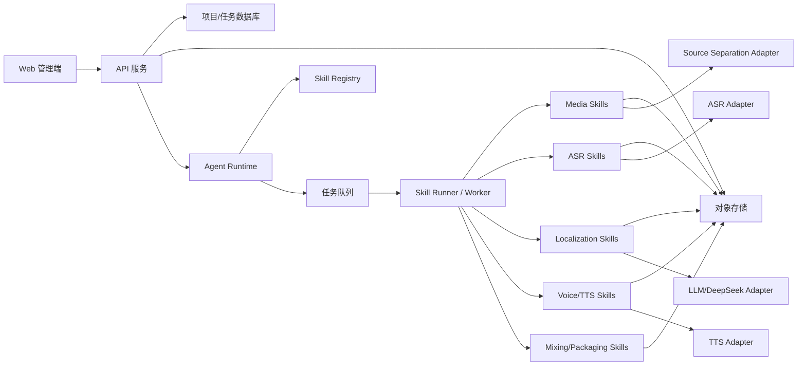
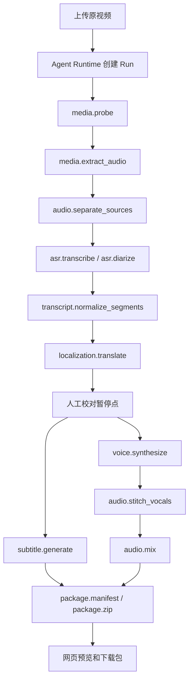

# AI 短剧多语种翻译与音轨外切平台架构

## 1. 架构原则

- 生产链路优先：先保证从上传到可预览、可下载跑通。
- 模型可替换：ASR、翻译、TTS、声源分离全部使用适配层。
- 编排可复用：通过 Agent Runtime 编排独立 Skill，避免把流程写死在单一 Worker 中。
- 异步任务优先：视频处理、模型调用、混音和打包均走任务队列。
- 版本可追踪：每次翻译、配音、混音都生成版本，不直接覆盖历史结果。
- 人工可介入：AI 初稿必须能被运营校对和局部重跑。

## 2. 总体架构



## 3. 模块划分

### 3.1 Web 管理端

职责：

- 上传视频。
- 创建项目和处理任务。
- 展示处理进度。
- 编辑原文、译文、说话人和音色。
- 播放预览并切换字幕/音轨。
- 下载结果。

不负责：

- 不在前端持有模型 API key。
- 不在前端执行重型音视频处理。
- 不直接访问底层对象存储私有路径。

### 3.2 API 服务

职责：

- 项目、文件、任务、版本管理。
- 生成上传和下载授权。
- 接收用户编辑。
- 创建和继续 Agent Run。
- 汇总任务状态。
- 提供播放器所需 manifest。

### 3.3 Agent Runtime

职责：

- 根据处理模板生成执行计划。
- 调用媒体、ASR、翻译、TTS、混音、打包等 Skill。
- 维护 run_context。
- 在人工校对点暂停。
- 记录每个 Skill Run 的输入、输出、耗时、错误和模型使用情况。
- 处理重试、跳过和局部重跑。

不负责：

- 不直接执行 FFmpeg 或模型推理。
- 不持有前端用户态可见的 API key。
- 不绕过 locked segment 或人工校对点。

### 3.4 Skill Registry

职责：

- 记录可用 Skill 名称、版本、输入输出 Schema 和默认 Provider。
- 支持替换具体实现，例如从本地 faster-whisper 切到云端 ASR。
- 支持按语言或项目配置默认翻译/TTS Provider。

### 3.5 任务队列

职责：

- 管理耗时任务。
- 支持重试。
- 支持失败记录。
- 支持按 project_id、run_id 和 version_id 追踪。

建议：

- MVP 可使用 Redis Queue、Celery、BullMQ、Sidekiq 等成熟队列。
- 不建议把视频处理放在普通 HTTP 请求里同步执行。

### 3.6 Skill Runner / Worker

职责：

- 执行具体 Skill。
- 调用 FFmpeg、ASR、DeepSeek、TTS、声源分离等工具或模型。
- 将大文件写入对象存储。
- 将结构化结果写回数据库或返回给 Agent Runtime。

### 3.7 对象存储

存储内容：

- 原视频。
- 原始音频。
- 分离后人声。
- 分离后背景音。
- ASR JSON。
- 翻译 JSON。
- 字幕文件。
- TTS 分段音频。
- 混合音轨。
- 预览 MP4。
- 下载压缩包。

### 3.8 数据库

建议保存：

- 项目元数据。
- 任务状态。
- Agent Run 和 Skill Run。
- 句段结构。
- 语言版本。
- 文件索引。
- 人工编辑记录。
- 模型调用记录。

不建议保存：

- 大型音视频二进制内容。

## 4. 处理管线



## 5. Agent + Skill 编排

MVP 建议使用固定编排模板，不要求 Agent 自主规划全部路径。

### 5.1 字幕初稿模板

```text
media.probe
media.extract_audio
audio.separate_sources
asr.transcribe
transcript.normalize_segments
localization.translate
subtitle.generate
pause_for_proofreading
```

### 5.2 完整外切模板

```text
media.probe
media.extract_audio
audio.separate_sources
asr.transcribe
asr.diarize
transcript.normalize_segments
localization.translate
pause_for_proofreading
subtitle.generate
voice.synthesize
audio.stitch_vocals
audio.mix
package.manifest
package.zip
```

### 5.3 局部重跑模板

```text
voice.synthesize selected_segments
audio.stitch_vocals target_language
audio.mix target_language
package.manifest
```

更完整的 Agent/Skill 设计见 [AGENT_SKILL_ARCHITECTURE.md](./AGENT_SKILL_ARCHITECTURE.md)。

## 6. 模型与开源组件建议

### 6.1 音视频处理

推荐 FFmpeg 作为基础音视频处理工具，用于：

- 视频探测。
- 音频提取。
- 音频格式转换。
- 音量归一化。
- 音轨混合。
- 预览 MP4 打包。

### 6.2 声源分离

目标：保留 BGM/环境声，仅替换人声。

可选方案：

- Demucs：成熟的音乐/人声分离开源方案，可作为本地分离基线。
- Ultimate Vocal Remover 相关模型：可作为运营离线验证或后续增强参考。
- 商业声源分离 API：当本地分离质量或性能不足时可接入。

边界：

- 声源分离是概率性结果，不保证完全去除原人声。
- 对短剧对白场景，分离质量需要用真实样本验证。

### 6.3 ASR

推荐优先级：

1. faster-whisper：适合作为高性能 Whisper 推理基线。
2. WhisperX：适合需要更好的时间戳、词级对齐和说话人标记的场景。
3. 云端 ASR：当本地模型精度或性能不足时接入。

MVP 建议：

- 第一版直接使用 WhisperX 或 faster-whisper。
- 如果需要说话人识别，再接 pyannote.audio 或 WhisperX diarization。
- ASR 输出必须进入统一 segment 数据结构，不能把模型原始输出直接暴露给业务。

### 6.4 翻译

默认建议：

- 使用 DeepSeek 作为 LLM 翻译适配器。
- 使用系统提示词约束短剧本地化风格。
- 支持 glossary、角色设定、目标地区和禁用词。

注意：

- 翻译模型名称必须配置化。
- prompt 版本必须记录。
- 不同语言可以使用不同 prompt。
- 翻译失败必须可重试。

### 6.5 TTS

MVP 推荐采用 Provider Adapter：

- MiniMax TTS。
- 豆包/火山引擎 TTS。
- 开源 TTS 或轻量模型。
- 后续可接 ElevenLabs、Azure、OpenAI 或其他供应商。

TTS 统一输入：

- 目标语言。
- 文本。
- speaker_id。
- voice_id。
- 目标时长。
- 语速。
- 情绪或风格。

TTS 统一输出：

- 音频文件。
- 实际时长。
- 供应商任务 ID。
- 失败原因。

## 7. 网页播放器方案

### 7.1 MVP 推荐方案

- 视频元素播放原画面。
- 字幕使用 WebVTT 自定义渲染。
- 音频轨使用独立 audio 元素或 Web Audio 控制。
- 切换音轨时保持当前播放时间同步。

### 7.2 原因

不同浏览器对 MP4 多音轨和 audioTracks 的支持不一致。MVP 为保证网页预览稳定，不应依赖浏览器原生多音轨切换作为唯一方案。

### 7.3 下载产物

可额外生成多音轨 MP4 作为下载或后处理文件，但网页预览以 manifest + 独立音轨 + VTT 为主。

## 8. 部署建议

### 8.1 MVP 单机/小集群

适合早期验证：

- Web/API 服务。
- Agent Runtime 服务。
- Skill Runner / Worker 服务。
- Redis 队列。
- PostgreSQL。
- 本地磁盘或 S3 兼容对象存储。
- 一台 GPU 机器用于 ASR、声源分离或本地 TTS。

### 8.2 生产增强

当任务量增加后：

- Media Skill Runner、ASR Skill Runner、TTS Skill Runner 拆分部署。
- GPU Worker 独立伸缩。
- 模型 API 加入限流和熔断。
- 对象存储生命周期清理。
- 增加任务成本统计。

## 9. 成本与性能考虑

影响成本的主要因素：

- 视频时长。
- 目标语言数量。
- 是否启用声源分离。
- 是否启用说话人识别。
- TTS 供应商价格。
- 是否生成整条 MP4 预览。

MVP 建议：

- 默认目标语言不超过 3 个。
- 默认视频不超过 3 分钟。
- 默认只在用户确认翻译后生成 TTS。
- 支持按语言局部重跑，避免整条重算。

## 10. 关键边界

- 平台只生成辅助本地化产物，不保证最终发布合规。
- 平台不默认允许未经授权的声音克隆。
- 平台不承诺完全替换原人声。
- 平台不承诺配音与口型完全一致。
- 平台不承诺 AI 翻译无需人工审核。
- Agent Runtime 不允许执行来自前端的任意代码。

## 11. 参考项目

- FFmpeg：音视频探测、转码、混流和打包。
- OpenAI Whisper：ASR 基础模型参考。
- faster-whisper：Whisper 高性能推理实现。
- WhisperX：词级时间戳、对齐、VAD、说话人相关能力参考。
- pyannote.audio：说话人识别参考。
- Demucs：人声/伴奏分离参考。
- VideoLingo：视频翻译、字幕、配音链路参考。
